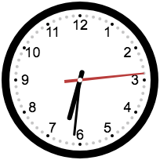
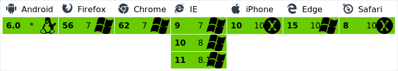
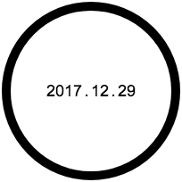

# canvas-clork

## A clork drawed by canvas
CVClork a clork drawed by canvas.It's a quartz analog clork which can display time and date.

## Usage
1.Import **vue.js** into your html  
2.Import **canvas-clork.js** into your html( Step 1, 2 cannot be reversed )  
3.Use tagname:`<canvas-clork></canvas-clork>`  
4.You can custom the size just like:`<canvas-clork size="200px"></canvas-clork>`

## Change working mode
Just click once on the dial plate,it will change time mode to date mode or vice versa.             

  <----Click---->  

## License
Copyright (c) 2017-present, Tianyi(Sky) Liu
